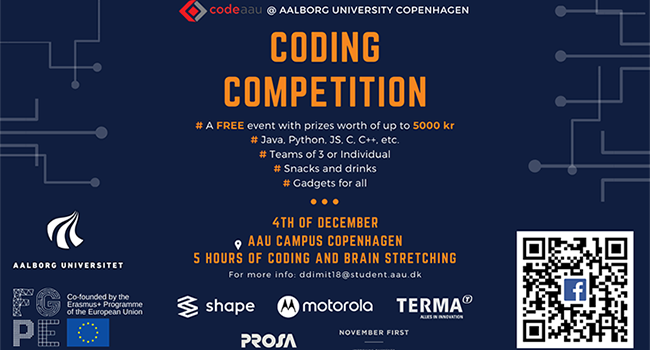

# Coding Competition AAU, 2019

This repository contains the resulting code from Coding Competition at AAU, 2019.

https://www.en.cph.aau.dk/events/show-event/coding-competition.cid429868

The solutions has been developed in Java. Python solutions will be added over time.

We managed to complete every assignment within the 5 hour time limit, resulting in a 2. place.

My school wrote an article about the experience, read it here:  
https://kea.dk/om-kea/nyheder/keas-datamatikere-t%C3%A6ver-universiteterne-i-stor-programmeringskonkurrence (In danish)

The team was composed of:
- Thomas Dahl
- Knud Billing
- Rasmus Knoth Nielsen
